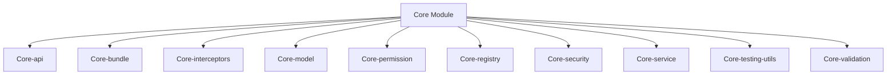
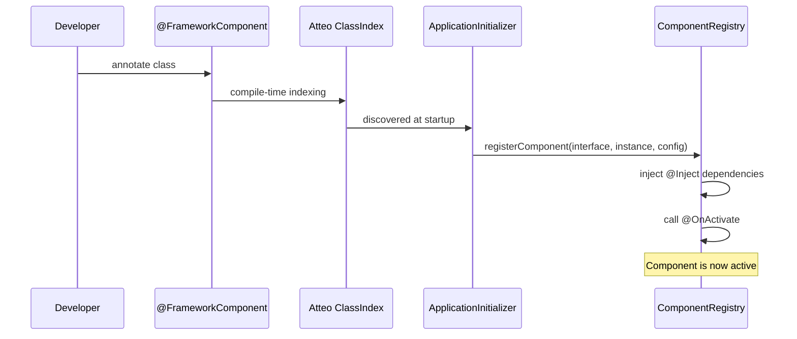
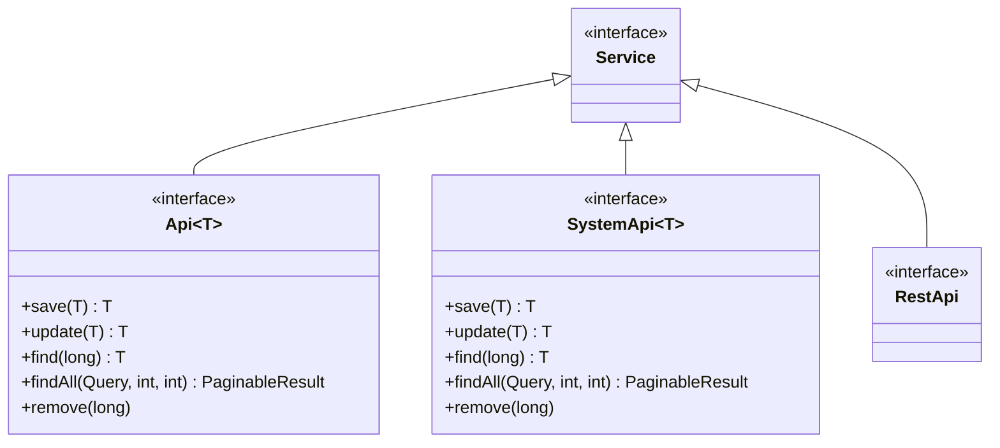

# Core Module

The **Core** module is the foundation of the Water Framework. It defines all the base interfaces, abstract classes, annotations, and services that every other module builds upon. It is technology-agnostic — it contains no Spring, OSGi, or Quarkus dependencies — providing a pure abstraction layer for component management, security, persistence, REST, validation, and interceptors.

## Architecture Overview



## Sub-modules

| Sub-module | Description |
|---|---|
| **Core-api** | All core interfaces: `Service`, `BaseEntityApi`, `BaseEntitySystemApi`, `RestApi`, `BaseRepository`, `QueryBuilder`, `ComponentRegistry`, `Runtime`, `SecurityContext`, `PermissionManager`, etc. |
| **Core-bundle** | Application initialization: `WaterRuntime`, `ApplicationInitializer`, `RuntimeInitializer`, component bootstrap, property loading |
| **Core-interceptors** | Method interception framework: `WaterAbstractInterceptor`, interceptor annotations, AOP execution chain |
| **Core-model** | Base data models: `AbstractResource`, `BaseError`, custom exceptions (`UnauthorizedException`, `ValidationException`, `EntityNotFound`, etc.) |
| **Core-permission** | Permission engine: `DefaultPermissionManager`, action definitions (`CrudActions`), access control annotations (`@AccessControl`, `@DefaultRoleAccess`), `PermissionUtil` |
| **Core-registry** | Component registry abstraction: `AbstractComponentRegistry`, `ComponentFilter`, `ComponentFilterBuilder`, component configuration factory |
| **Core-security** | Security context: `WaterAbstractSecurityContext`, `EncryptionUtil`, security annotations (`@AllowPermissions`, `@AllowRoles`, `@AllowPermissionsOnReturn`, `@AllowGenericPermissions`) |
| **Core-service** | Base service implementations: `AbstractService`, service integration and discovery utilities |
| **Core-testing-utils** | Test framework: `WaterTestExtension` (JUnit 5), `TestRuntimeInitializer`, `TestPermissionManager`, `TestComponentRegistry`, test user/role models |
| **Core-validation** | Validation annotations and validators: `@NoMalitiusCode`, `@NotNullOnPersist`, `WaterValidator` |

## Key Concepts

### Component Lifecycle



### API Layer Hierarchy



- **Api** — Public-facing, enforces permission checks via interceptors
- **SystemApi** — Internal service-to-service calls, bypasses permissions
- **RestApi** — HTTP endpoints, delegates to `Api`

### Permission System

```mermaid
graph LR
    A[Entity] -->|@AccessControl| B[Available Actions]
    A -->|@DefaultRoleAccess| C[Default Roles]
    C -->|mapped to| B
    D[User] -->|assigned| C
    E[PermissionManager] -->|checks| D
    E -->|against| B
    F[@AllowPermissions] -->|triggers| E
```

Permissions are defined declaratively on entities and enforced automatically by interceptors:

```java
@Entity
@AccessControl(
    availableActions = { CrudActions.class },
    rolesPermissions = {
        @DefaultRoleAccess(roleName = "myEntityManager", actions = { "save","update","find","find_all","remove" }),
        @DefaultRoleAccess(roleName = "myEntityViewer", actions = { "find","find_all" })
    })
public class MyEntity extends AbstractJpaEntity implements ProtectedEntity { }
```

### Interceptor Chain

Interceptors implement cross-cutting concerns (security, logging, validation) using annotations:

| Annotation | Purpose |
|---|---|
| `@AllowPermissions` | Check specific entity action permissions |
| `@AllowGenericPermissions` | Check generic action permissions |
| `@AllowPermissionsOnReturn` | Validate permissions on returned entity |
| `@AllowRoles` | Restrict access to specific roles |

### Dependency Injection

```java
@FrameworkComponent
public class MyServiceImpl implements MyService {
    @Inject
    private OtherService otherService;  // Resolved from ComponentRegistry

    @OnActivate
    public void activate() {
        // Called after all dependencies are injected
    }

    @OnDeactivate
    public void deactivate() {
        // Called before component is unregistered
    }
}
```

### Query Builder

The `QueryBuilder` provides a fluent, technology-agnostic API for constructing queries:

```java
@Inject
private ComponentFilterBuilder filterBuilder;

// Build a filter query
Query query = filterBuilder.createQueryFilter("name=John AND age>25");

// Use with findAll
PaginableResult<MyEntity> results = myEntityApi.findAll(query, 10, 1);
```

### Validation Annotations

| Annotation | Description |
|---|---|
| `@NoMalitiusCode` | Prevents code injection (XSS, script tags) |
| `@NotNullOnPersist` | Ensures field is not null when persisting |
| Standard JSR-303 | `@NotNull`, `@Size`, `@Pattern`, etc. |

## Testing

The `Core-testing-utils` module provides a complete test harness:

```java
@ExtendWith(WaterTestExtension.class)
@TestInstance(TestInstance.Lifecycle.PER_CLASS)
public class MyEntityApiTest implements Service {

    @Inject
    private ComponentRegistry componentRegistry;

    @Inject
    private MyEntityApi myEntityApi;

    @Inject
    private Runtime runtime;

    @Test
    void testSave() {
        // TestPermissionManager allows impersonation
        TestPermissionManager pm = (TestPermissionManager)
            componentRegistry.findComponent(PermissionManager.class, null);
        pm.impersonateUser(adminUser);

        MyEntity entity = new MyEntity();
        entity.setName("test");
        MyEntity saved = myEntityApi.save(entity);
        assertNotNull(saved.getId());
    }
}
```

## Technology Stack

| Technology | Purpose |
|---|---|
| Java 17+ | Language |
| Atteo ClassIndex | Compile-time annotation indexing (zero-reflection discovery) |
| SLF4J | Logging abstraction |
| BouncyCastle | Cryptographic operations |
| Jakarta Validation | Declarative data validation (JSR-303) |
| Lombok | Boilerplate reduction |

## Getting Started

**Prerequisites:** Java 17+, Gradle

```bash
# Build the Core module
yo water:build --projects=Core
```

The Core module is a dependency of every other Water module. You typically don't import it directly — it's pulled in transitively through modules like `Repository`, `Rest`, `Permission`, etc.

## Dependencies

The Core module has **no runtime framework dependencies** (no Spring, no OSGi). It depends only on:
- Jakarta Validation API
- Jakarta WS-RS API (for REST annotations)
- SLF4J (logging)
- Atteo ClassIndex (compile-time indexing)
- BouncyCastle (encryption)
- Lombok (compile-time)
